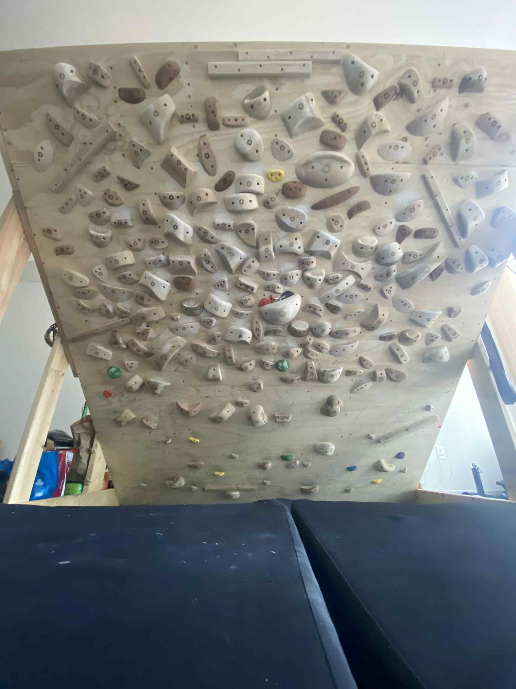

## About

I'm an engineer. I love thinking, running experiments, climbing, and reading.

I seek to have new thoughts which haven't existed in the world yet. Read the [The thinking framework](https://visualtransporter.substack.com/p/the-thinking-framework) which is my plan to understand my brain and push my limits!

Currently I work at [Warpstream Labs](https://www.warpstream.com/) where I solve hardcore problems. My proudest technical achievement at my job so far is making the most crucial bottleneck in the system 3x faster allowing the system to handle unimaginable workloads!

## Writing

- [Notes on writing correct software](https://visualtransporter.substack.com/p/notes-on-writing-correct-software) - Hear me out!
- [The thinking framework](https://visualtransporter.substack.com/p/the-thinking-framework) - How I attempt to understand my mind.

## Climbing Wall

This is my climbing wall which I built from scratch using my own two hands! It is 50 degrees overhanging from vertical and has some holds
which are less than 10mm deep. Awesome. The wall is 9.5 feet tall along the incline and 8 feet wide.

